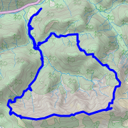
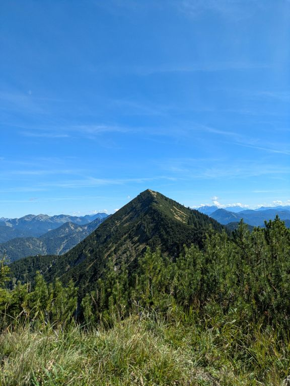
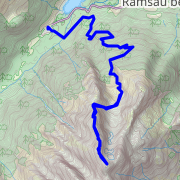
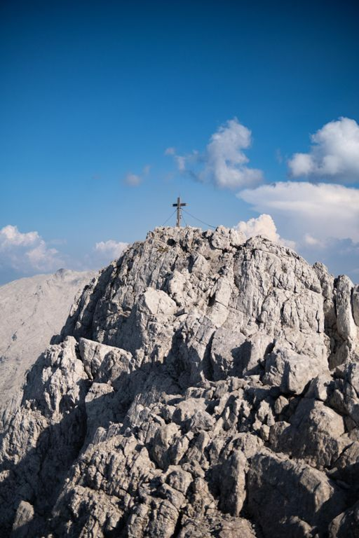
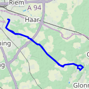
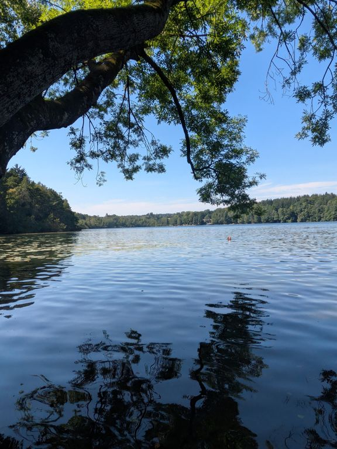

# Sebastian Wieland

I am a web-developer, proficient in both backend and frontend development.

## About me

- Programming professionally since 2014
- Say what you want, my heart belongs to Java
- Vim is more than an editor, it's a religion
- Team Tabs! Fuck Spaces! (Only with tabs you can `:set ts=<n>` without having
  to <kbd>g</kbd><kbd>g</kbd><kbd>=</kbd><kbd>G</kbd>)

## Contact

If you want to contact me, consider sending your message end-to-end encrypted
to stop big nosy corporations or evil governments from snooping around and
selling your data! You can do this effortlessly at
[sebastianwie.land/contact](https://sebastianwie.land/contact). Alternatively,
you can find my PGP key via WKD using the email address in my profile, or here:
[D34D 12E4 12ED EF1A](https://sebastianwie.land/pgp-pubkey.asc). _[(What is
this?)](https://ssd.eff.org/en/module/deep-dive-end-end-encryption-how-do-public-key-encryption-systems-work)_

If you want to contact me and you're not interested in privacy, just send me an
email using the address in my profile.

---

### Some of my most recent adventures

<table><tr>
<th colspan="2">
<a href="https://www.strava.com/activities/15683789833">
🚶🏽‍♂️ Halserspitz
</a>
</th>
</tr><tr>
<td>

**Hike on 2025-09-03**

- Distance: 20.97 km
- Time: 5.7 h
- Elevation Gain: 1345 m
</td>
<td>

</td>
</tr><tr>
<th colspan="2">
<a href="https://www.strava.com/activities/15470992900">
🚶🏽‍♂️ Hochkalter
</a>
</th>
</tr><tr>
<td>

**Hike on 2025-08-15**

- Distance: 13.62 km
- Time: 4.4 h
- Elevation Gain: 1903 m
</td>
<td>

</td>
</tr><tr>
<th colspan="2">
<a href="https://www.strava.com/activities/15399646089">
🚲 Afternoon Ride
</a>
</th>
</tr><tr>
<td>

**Ride on 2025-08-09**

- Distance: 47.62 km
- Time: 1.8 h
- Elevation Gain: 216 m
</td>
<td>

</td>
</tr></table>