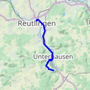
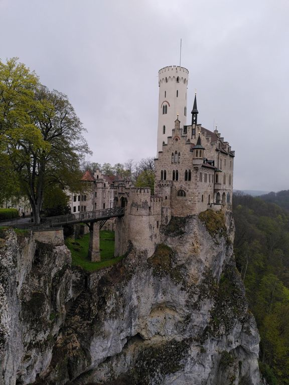
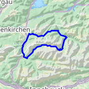
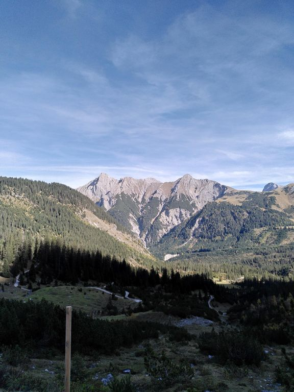
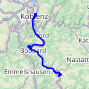
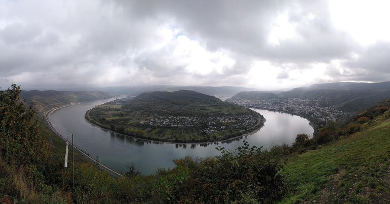

# Sebastian Wieland

I am a web-developer, proficient in both backend and frontend development.

## About me

- Programming professionally since 2014
- Say what you want, my heart belongs to Java
- Vim is more than an editor, it's a religion
- Team Tabs! Fuck Spaces! (Only with tabs you can `:set ts=<n>` without having
  to <kbd>g</kbd><kbd>g</kbd><kbd>=</kbd><kbd>G</kbd>)

## Contact

If you want to contact me, consider sending your message end-to-end encrypted
to stop big nosy corporations or evil governments from snooping around and
selling your data! You can do this effortlessly at
[sebastianwie.land/contact](https://sebastianwie.land/contact). Alternatively,
you can find my PGP key via WKD using the email address in my profile, or here:
[D34D 12E4 12ED EF1A](https://sebastianwie.land/pgp-pubkey.asc). _[(What is
this?)](https://ssd.eff.org/en/module/deep-dive-end-end-encryption-how-do-public-key-encryption-systems-work)_

If you want to contact me and you're not interested in privacy, just send me an
email using the address in my profile.

---

### Some of my most recent adventures

<table><tr>
<th colspan="2">
<a href="https://www.strava.com/activities/7063983700">
🚲 Lichtenstein I
</a>
</th>
</tr><tr>
<td>

**Ride on 2022-04-30**

- Distance: 16.28 km
- Time: 1.1 h
- Elevation Gain: 476 m
</td>
<td>

</td>
</tr><tr>
<th colspan="2">
<a href="https://www.strava.com/activities/6141039127">
🚲 Karwendelrunde
</a>
</th>
</tr><tr>
<td>

**Ride on 2021-10-20**

- Distance: 66.27 km
- Time: 5.7 h
- Elevation Gain: 1808 m
</td>
<td>

</td>
</tr><tr>
<th colspan="2">
<a href="https://www.strava.com/activities/6106842763">
🚲 Den Rhein Entlang
</a>
</th>
</tr><tr>
<td>

**Ride on 2021-10-13**

- Distance: 59.44 km
- Time: 3.6 h
- Elevation Gain: 586 m
</td>
<td>

</td>
</tr></table>